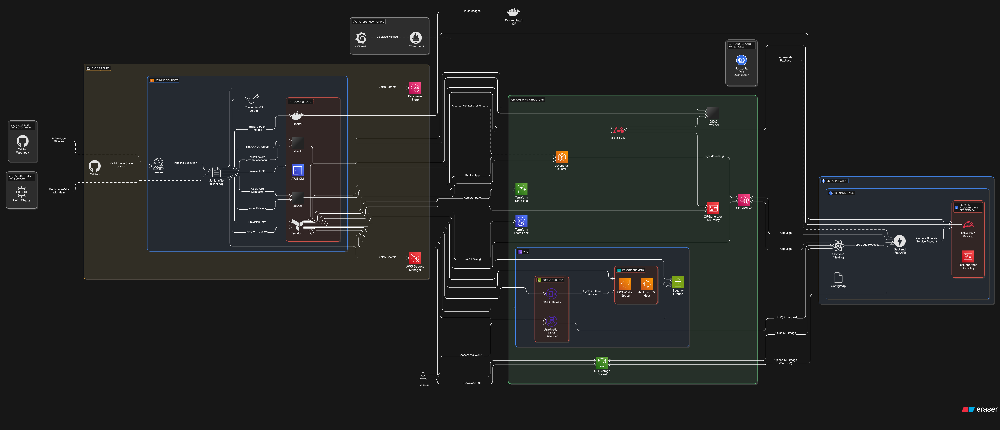
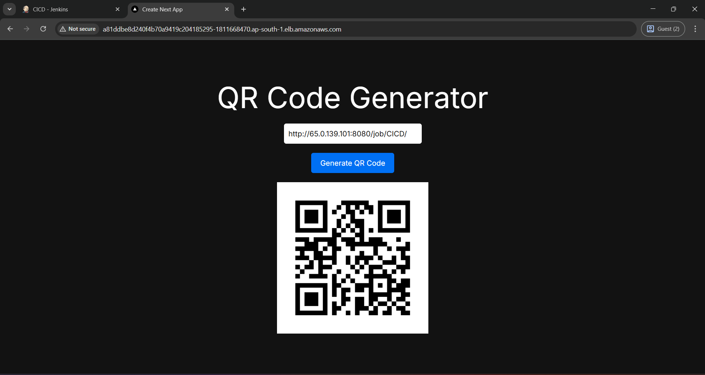

# 🚀 DevOps QR Code Generator – EKS | Terraform | Jenkins | IRSA

[](https://github.com/Rahul-Kumar-Paswan/DevOps-QR-Generator)
[](https://github.com/Rahul-Kumar-Paswan/DevOps-QR-Generator/graphs/contributors)
[](https://www.python.org/)
[](https://aws.amazon.com/)


A production-grade **DevOps project** that deploys a full-stack QR Code Generator on **Amazon EKS**, using **IRSA for secure S3 integration**, fully modular **Terraform infrastructure**, and a robust **CI/CD pipeline via Jenkins**.

---

## 🖥️ Project Overview

This project demonstrates a real-world DevOps pipeline:

- ✅ **Frontend**: Next.js app for user interaction  
- ✅ **Backend**: FastAPI service to generate and upload QR codes to **AWS S3**  
- ✅ **Infrastructure**: Provisioned using modular **Terraform**  
- ✅ **Kubernetes**: Deployed on **Amazon EKS**, using **IRSA** for IAM role binding  
- ✅ **CI/CD**: Automated with Jenkins pipeline hosted on EC2  

---

## 🧱 Architecture / Workflow


---

## 🧭 Table of Contents

- [🖥️ Project Overview](#️-project-overview)
- [🧱 Architecture / Workflow](#-architecture--workflow)
- [✨ Features](#-features)
- [🧰 Tech Stack](#-tech-stack)
- [⚙️ Prerequisites](#-prerequisites)
- [📂 Project Structure](#-project-structure)
- [🖥️ Jenkins EC2 Setup](#️-jenkins-ec2-setup)
- [🛠️ Local Development](#️-local-development)
- [🐳 Docker Setup](#-docker-setup)
- [🏗️ Infrastructure as Code (Terraform)](#️-infrastructure-as-code-terraform)
- [☸️ Kubernetes Deployment (IRSA)](#️-kubernetes-deployment-eks--irsa)
- [⚡ Jenkins CI/CD Pipeline](#️-jenkins-cicd-pipeline)
- [🔒 Security & Best Practices](#-security--best-practices)
- [💰 Cost Optimization](#-cost-optimization)
- [📝 Environment Variables](#️-environment-variables)
- [📸 Screenshots / Demo](#️-screenshots--demo)
- [📚 Learning / Takeaways](#️-learning--takeaways)
- [🧹 Cleanup](#️-cleanup)
- [📌 TODO / Future Enhancements](#️-todo--future-enhancements)
- [🤝 Contributing](#️-contributing)
- [📝 License](#️-license)

---

## ✨ Features

- ✅ Secure QR code generation & storage in S3  
- ✅ Kubernetes-native deployment on Amazon EKS  
- ✅ IRSA-based IAM integration for secure AWS access  
- ✅ Modular Terraform infrastructure (VPC, EKS)  
- ✅ Full CI/CD with Jenkins  
- ✅ Dockerized microservices (frontend & backend)  
- ✅ Easy destroy and cleanup option built into pipeline  

---

## 🧰 Tech Stack

| Layer    | Tools & Tech                                            |
| -------- | ------------------------------------------------------- |
| Frontend | Next.js, React                                          |
| Backend  | FastAPI (Python)                                        |
| DevOps   | Docker, Jenkins, Kubernetes, Terraform, AWS CLI, eksctl |
| Cloud    | AWS EKS, S3, IAM, OIDC, IRSA                            |
| CI/CD    | Jenkins on EC2, GitHub SCM                              |
| IaC      | Terraform (Modular: VPC, EKS)                           |

---

## ⚙️ Prerequisites

- ✅ Docker  
- ✅ AWS CLI v2  
- ✅ kubectl  
- ✅ eksctl  
- ✅ Terraform  
- ✅ Git  
- ✅ Jenkins (running on EC2 with Docker access)  

---

## 📂 Project Structure

```bash
DevOps-QR-Generator/
├── Infra/                        # Terraform code
│   ├── modules/                 # Modules for EKS and VPC
│   ├── main.tf
│   ├── output.tf
│   └── terraform.tfvars
├── QR-Generator/                # Application source code
│   ├── backend-api/             # FastAPI backend
│   └── front-end-nextjs/        # Next.js frontend
├── K8S-IRSA/                    # Kubernetes + IRSA manifests
│   ├── backend-deployment.yaml
│   ├── configmap.yaml
│   └── frontend-deployment.yaml
├── Jenkinsfile                  # Jenkins pipeline
├── server-setup.sh             # Jenkins EC2 bootstrap script
├── screenshots/                # Project screenshots
└── README.md
```
---
## 🖥️ Jenkins EC2 Setup (CI/CD Host)

Provision a t2.small EC2 Ubuntu instance and run:

```bash
chmod +x server-setup.sh
./server-setup.sh
```
This will install:
- Jenkins
- Docker (with permission for jenkins user)
- AWS CLI
- Terraform
- kubectl
- eksctl
Reboot the EC2 instance after the setup completes to apply Docker group changes for the Jenkins user.

---
## 🛠️ Local Development
### 🔧 Frontend (Next.js)
```bash
cd QR-Generator/front-end-nextjs
npm install
npm run dev
```
### 🧪 Backend (FastAPI)
```bash
cd QR-Generator/backend-api
pip install -r requirements.txt
uvicorn main:app --reload
```
---
## 🐳 Docker Setup (Dev + Prod)
### 🐳 Build Backend Image
```bash
cd QR-Generator/backend-api/
docker build -t <your-image-name> .
```

### 🐳 Build Frontend Image
```bash
cd QR-Generator/front-end-nextjs/
docker build -t <your-image-name> .
```

### 🐳 Docker Compose (Optional)
```bash
docker-compose up --build
```

---
## 🏗️ Infrastructure as Code (Terraform)

Terraform code in Infra/ is organized in modules.

Usage
```bash
cd Infra/
terraform init
terraform apply -var-file=terraform.tfvars
```

Creates:
- VPC
- EKS Cluster
- Node groups (managed nodes)

---
## ☸️ Kubernetes Deployment (EKS + IRSA)
### ✅ IRSA Setup

Associate IAM OIDC provider and create a service account with IAM policy using eksctl:
```bash
eksctl utils associate-iam-oidc-provider \
  --region ap-south-1 \
  --cluster devops-qr-cluster \
  --approve

eksctl create iamserviceaccount \
  --name aws-secrets-sa \
  --cluster devops-qr-cluster \
  --region ap-south-1 \
  --attach-policy-arn arn:aws:iam::<ACCOUNT_ID>:policy/QRGenerator-S3-Policy \
  --approve
```

### ✅ Apply Kubernetes Manifests
```bash
kubectl apply -f K8S-IRSA/configmap.yaml
kubectl apply -f K8S-IRSA/backend-deployment.yaml
kubectl apply -f K8S-IRSA/frontend-deployment.yaml
```

### 🔍 Verify
```bash
kubectl get pods
kubectl get svc
```

---
## ⚡ Jenkins CI/CD Pipeline

This project supports both **manual** and **automatic** triggers for deploying or destroying the infrastructure and application on **EKS** using Jenkins.

---

### 🚀 Trigger Options

#### 🔘 Manual Trigger (via Jenkins UI)

1. Go to your Jenkins job.
2. Click **Build with Parameters**.
3. Use the `ACTION` dropdown to select:

   - `create` → Provision infrastructure and deploy the app  
   - `destroy` → Tear down infrastructure and Kubernetes resources

---

#### 🔁 Automatic Trigger (via GitHub Webhook)

CI/CD is triggered **automatically** when:

- 🚀 Code is pushed to the `main` branch  
- 🔀 A pull request is merged into `main`

This is configured using a **GitHub Webhook** integrated with Jenkins.

---

### 🔧 GitHub Webhook Setup

1. ✅ Find your Jenkins public IP or domain:  
   `http://<YOUR_PUBLIC_IP>:8080`

2. ✅ In your GitHub repository, go to:  
   **Settings → Webhooks → Add Webhook**

3. ✅ Fill out the webhook form:

| Field           | Value                                                          |
|----------------|-----------------------------------------------------------------|
| **Payload URL** | `http://<YOUR_JENKINS_PUBLIC_IP>:8080/github-webhook/`         |
| **Content Type**| `application/json`                                             |
| **Secret**      | *(Optional for added security)*                                |
| **Events**      | ✅ Just the **Push event**                                      |

4. ✅ Click **Add Webhook**

5. ✅ After adding, check **Recent Deliveries** → a successful webhook shows:  
   **Response: 200 OK**

---

### ⚙️ Jenkins Job Configuration

1. Open Jenkins Dashboard → your **Pipeline Job**
2. Click **Configure**
3. Under **Build Triggers**, check:  
   ✅ **GitHub hook trigger for GitSCM polling**

4. In **Pipeline Script from SCM**, confirm:

```groovy
git branch: 'main',
url: 'https://github.com/Rahul-Kumar-Paswan/DevOps-QR-Generator.git'
```
- ✅ This ensures Jenkins always pulls the latest code from the main branch whenever a push or PR merge occurs.
---
### 📋 Jenkinsfile Overview
| Stage                              | Purpose                                            |
| ---------------------------------- | -------------------------------------------------- |
| 🧹 Cleanup Workspace               | Clears the Jenkins workspace                       |
| 📥 Checkout Code                   | Pulls the latest code from the `main` branch       |
| 🛠️ Terraform Init & Apply/Destroy | Provisions or destroys AWS infrastructure          |
| 🐳 Build & Push Docker Images      | Builds and pushes backend & frontend Docker images |
| 🚀 Deploy to Kubernetes            | Deploys application to EKS via kubectl manifests   |
| 🔍 Verify K8s Deployment           | Verifies pods and services are running and healthy |
| 🧹 Cleanup (destroy only)          | Cleans up K8s and AWS resources when destroying    |

---
## 🔒 Security & Best Practices

- Used IRSA for secure AWS access (no static keys)
- Followed least privilege IAM policy design
- Docker images built using non-root users
- All secrets managed via Kubernetes Service Accounts
- Terraform remote backend secured with S3 + DynamoDB state locking

---
## 💰 Cost Optimization

- Used t3.small EKS nodes for cost-performance balance
- Cleanup automation (terraform destroy) to prevent idle costs
- Terraform modularization allows selective resource creation

---
## 📝 Environment Variables

Handled via configmap.yaml or embedded into manifests using envsubst.

| Variable   | Description                        |
| ---------- | ---------------------------------- |
| S3_BUCKET  | AWS S3 bucket for storing QR codes |
| AWS_REGION | AWS region (e.g., ap-south-1)      |
| BASE_URL   | S3 base path for images            |

---
## 📸 Screenshots / Demo
Access the UI using the frontend service's LoadBalancer IP.
Below is a sample of the QR Generator UI deployed on EKS.
  
_For more UI pages, check the [`/screenshots`](./screenshots) folder._

---
## 📚 Learning / Takeaways

- 🔐 Mastered IRSA for secure AWS access from EKS
- ⚙️ Used modular Terraform for clean infra provisioning
- ☁️ Built and deployed microservices on EKS
- 🔄 Created full CI/CD pipeline with Jenkins
- 🧩 Implemented clean separation of concerns (infra/app/cicd)

---
## 🧹 Cleanup
### 🧼 Delete Kubernetes Resources
```bash
kubectl delete -f backend-deployment.yaml
kubectl delete -f frontend-deployment.yaml
kubectl delete -f configmap.yaml
```

### 🔐 Delete IRSA IAM Role
```bash
eksctl delete iamserviceaccount \
  --name aws-secrets-sa \
  --cluster devops-qr-cluster \
  --region ap-south-1
```

---
## 📌 TODO / Future Enhancements

| Feature                                 | Status     |
| --------------------------------------- | ---------- |
| ✅ Secure IRSA Integration               | Completed  |
| ✅ Jenkins-based CI/CD                   | Completed  |
| ✅ Modular Terraform Infrastructure      | Completed  |
| ⚙️ GitHub Webhooks for CI Trigger       | Completed |
| 📦 Helm Chart Support                   | 🚧 Planned |
| 📈 Monitoring with Grafana + Prometheus | 🚧 Planned |
| 🔄 Auto-scaling for backend pods        | 🚧 Planned |

---
## 🤝 Contributing
Contributions, issues, and feature requests are welcome!  
Feel free to fork this repo and submit a pull request.  

---
## 📝 License

MIT License © 2025 Rahul Paswan
This project is licensed under the [MIT License](./LICENSE).